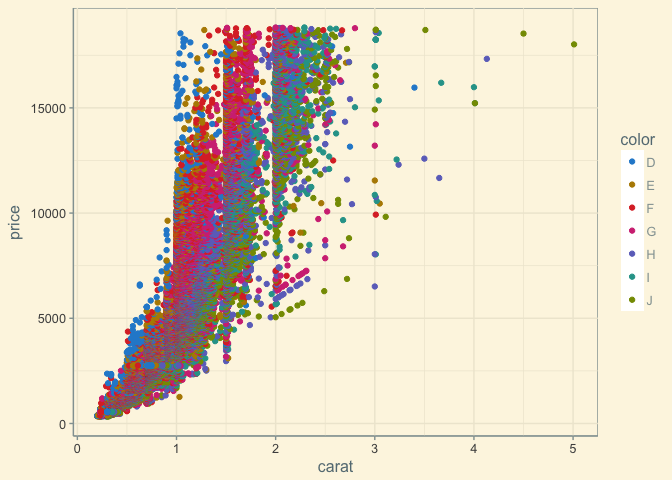

README
================

Overview
--------

This is a Shiny app to explore the diamonds dataset in [ggplot2](http://ggplot2.org/), and to predict the price of a diamond.

It's an updated version of a class project for [Developing Data Products](https://www.coursera.org/learn/data-products) as part of the [Data Science Specialization](https://www.coursera.org/specializations/jhu-data-science) on Coursera, August 2016.

See [Shiny home](https://shiny.rstudio.com/) for details on how to run the app.

